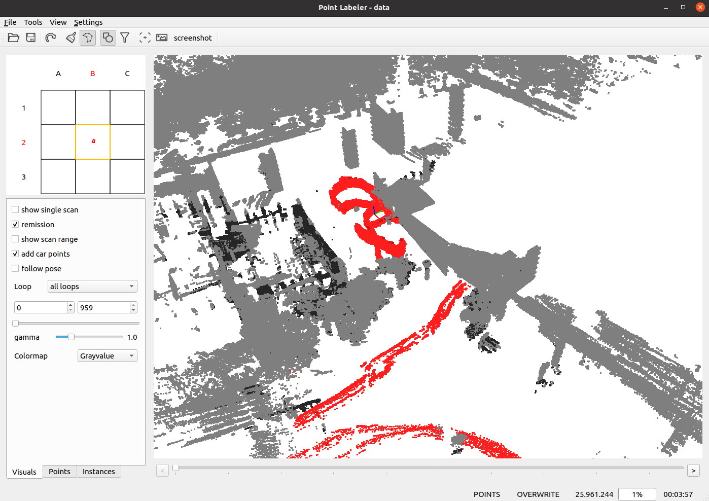

DynamicMap Benchmark Labeler
---

This is a fork of the [point_labeler](https://github.com/jbehley/point_labeler) tool. I modified it to adapt to [our benchmark format](https://github.com/KTH-RPL/DynamicMap_Benchmark). 

## Install

Test computer and System:

- Desktop setting: i9-12900KF, (GPU 3090, CUDA 11.3 no need)
- System setting: Ubuntu 20.04, ROS noetic (Python 3.8)
- Test Date: 2024/3/18

```bash
git clone https://github.com/Kin-Zhang/point_labeler.git
cd point_labeler
cmake -S . -B build
cmake --build build
```

## Usage

After build successfully, you can run the labeler by (you **need** `cd` to the `bin` directory):

```bash
cd bin
./labeler
```

Need [DynamicMap Benchmark format](https://github.com/KTH-RPL/DynamicMap_Benchmark) with `pcd`` folder and poses inside VIEWPOINTS meta on the pcd header.

More Usage on our dataset (semindoor example here):



## Acknowledgements

This tool implementation is based on SemanticKITTI where we fork the repo, check their official README. Our work was partially supported by the Wallenberg AI, Autonomous Systems and Software Program ([WASP](https://wasp-sweden.org/)) funded by the Knut and Alice Wallenberg Foundation

### Cite Our Paper

Please cite our work if you find these useful for your research.
```
@inproceedings{zhang2023benchmark,
  author={Zhang, Qingwen and Duberg, Daniel and Geng, Ruoyu and Jia, Mingkai and Wang, Lujia and Jensfelt, Patric},
  booktitle={IEEE 26th International Conference on Intelligent Transportation Systems (ITSC)}, 
  title={A Dynamic Points Removal Benchmark in Point Cloud Maps}, 
  year={2023},
  pages={608-614},
  doi={10.1109/ITSC57777.2023.10422094}
}
@article{daniel2024dufomap,
    author    = {Daniel, Duberg and Zhang, Qingwen and Jia, Mingkai and Jensfelt, Patric},
    title     = {DUFOMap: Efficient Dynamic Awareness Mapping},
    journal   = {arXiv preprint arXiv:2403.01449},
    year      = {2024},
}
```

<details>
  <summary>[Please check the official repo or below origin read for more detail]</summary>

# Point Cloud Labeling Tool

 Tool for labeling of a single point clouds or a stream of point clouds. 


Given the poses of a KITTI point cloud dataset, we load tiles of overlapping point clouds. Thus, multiple point clouds are labeled at once in a certain area. 

## Features
 - Support for KITTI Vision Benchmark Point Clouds.
 - Human-readable label description files in xml allow to define label names, ids, and colors.
 - Modern OpenGL shaders for rendering of even millions of points.
 - Tools for labeling of individual points and polygons.
 - Filtering of labels makes it easy to label even complicated structures with ease.

## Dependencies

* Eigen >= 3.2
* boost >= 1.54
* QT >= 5.2
* OpenGL Core Profile >= 4.0
 
## Build
  
On Ubuntu 22.04/20.04, the dependencies can be installed from the package manager:
```bash
sudo apt install git libeigen3-dev libboost-all-dev qtbase5-dev libglew-dev
```

Additionally, make sure you have [catkin-tools](https://catkin-tools.readthedocs.io/en/latest/) and the [fetch](https://github.com/Photogrammetry-Robotics-Bonn/catkin_tools_fetch) verb installed:
```bash
sudo apt install python-pip
sudo pip install catkin_tools catkin_tools_fetch empy
```

Then, build the project, change to the cloned directory and use the following commands:
```bash
cmake -S . -B build
cmake --build build
```

Alternatively, you can also use the "classical" cmake build procedure:
```bash
mkdir build && cd build
cmake ..
make -j5
```


Now the project root directory (e.g. `~/catkin_ws/src/point_labeler`) should contain a `bin` directory containing the labeler.


## Usage


In the `bin` directory, just run `./labeler` to start the labeling tool. 

The labeling tool allows to label a sequence of point clouds in a tile-based fashion, i.e., the tool loads all scans overlapping with the current tile location.
Thus, you will always label the part of the scans that overlaps with the current tile.


In the `settings.cfg` files you can change the followings options:

<pre>

tile size: 100.0   # size of a tile (the smaller the less scans get loaded.)
max scans: 500    # number of scans to load for a tile. (should be maybe 1000), but this currently very memory consuming.
min range: 0.0    # minimum distance of points to consider.
max range: 50.0   # maximum distance of points in the point cloud.
add car points: true # add points at the origin of the sensor possibly caused by the car itself. Default: false.

</pre>


## Folder structure

When loading a dataset, the data must be organized as follows:

<pre>
point cloud folder
├── velodyne/             -- directory containing ".bin" files with Velodyne point clouds.   
├── labels/   [optional]  -- label directory, will be generated if not present.  
├── image_2/  [optional]  -- directory containing ".png" files from the color   camera.  
├── calib.txt             -- calibration of velodyne vs. camera. needed for projection of point cloud into camera.  
└── poses.txt             -- file containing the poses of every scan.
</pre>


## Documentation

See the [wiki](https://github.com/jbehley/point_labeler/wiki) for more information on the usage and other details.


 ## Citation

If you're using the tool in your research, it would be nice if you cite our [paper](https://arxiv.org/abs/1904.01416):

```
@inproceedings{behley2019iccv,
    author = {J. Behley and M. Garbade and A. Milioto and J. Quenzel and S. Behnke and C. Stachniss and J. Gall},
     title = {{SemanticKITTI: A Dataset for Semantic Scene Understanding of LiDAR Sequences}},
 booktitle = {Proc. of the IEEE/CVF International Conf.~on Computer Vision (ICCV)},
      year = {2019}
}
```

We used the tool to label SemanticKITTI, which contains overall over 40.000 scans organized in 20 sequences. 
</details>
